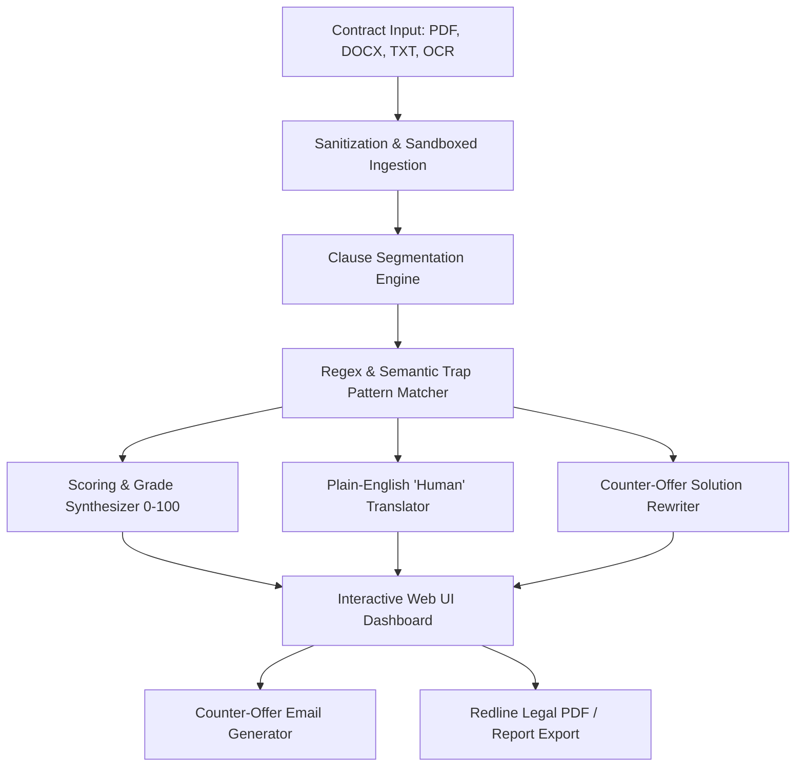

# PLANNING.md — Project Roadmap & Technical Architecture
**Project:** Freelancer Legal Contract Analyzer & Risky Clause Scorer  
**Level:** Level 2 — Intermediate  
**Target Completion:** 32 Hours  

---

## 1. Problem Statement & Motivation
Freelancers, student developers, and creative contractors regularly sign contracts containing traps:
- IP assignment before any payment is made
- "Pay-When-Paid" or Net-90 cashflow blockers
- Perpetual non-competes barring work in the field
- Unlimited personal financial indemnity
- Uncapped revision obligations leading to unpaid scope creep

Lawyer consultations cost $200–$500 per hour or ₹5,000–₹15,000 in India, pricing out early-career freelancers. **LexShield AI** provides an instant, privacy-respecting contract risk assessment, translates traps into everyday language, and automatically outputs **ready-to-send counter-offer clauses**.

---

## 2. System Architecture

### Key Components:
1. **Document Ingestion Layer (`backend/main.py`):**
   - Pure in-memory streams with `io.BytesIO`.
   - Native PDF text extraction using `pypdf`.
   - DOCX parsing using `python-docx`.
   - Immediate in-memory purging for sandboxed document privacy.

2. **Analysis & Rule Engine (`backend/analyzer.py`):**
   - 9 Risk Categories with custom weightings (IP, Payment, Non-Compete, Termination, Liability, Scope, Portfolio, Penalties, Jurisdiction).
   - Pattern matchers for 25+ specific predatory clauses.
   - Algorithmic Safety Score calculation (100 base score, penalizing detected traps down to minimum 5).
   - Plain English "Human" translator and "Why this hurts you" legal danger explainer.
   - **Counter-Offer Solution Engine**: Crafts exact legal substitute clauses and tactical negotiation dialogue for each problem.

3. **Presentation Layer (`frontend/index.html`, `frontend/app.js`, `frontend/style.css`):**
   - Responsive, dark/light theme web interface.
   - Animated SVG/CSS circular safety score gauge (0-100).
   - Category health progress bars.
   - Redline strikethrough cards paired with counter-offer substitute cards.
   - One-click copy and automated email generator.
   - Printable Redline Legal Export.

---

## 3. Sprint Milestones (32-Hour Plan)

- **Hours 0–6:** Architecture definition, problem decomposition, sample contract collection, and core FastAPI environment setup.
- **Hours 7–14:** Regex & NLP pattern matcher development covering FR-1, FR-2, and FR-3.
- **Hours 15–20:** Plain-English translation synthesis (FR-4) and Counter-Offer clause generator engine (FR-5).
- **Hours 21–26:** Frontend UI construction with animated score gauge, category health meters, and counter-offer email generator.
- **Hours 27–30:** Redline export module (FR-6), multi-page PDF/DOCX stress testing (< 8 seconds performance validation), and sandboxed memory privacy verification.
- **Hours 31–32:** Documentation completion (`README.md`, `PLANNING.md`, `PROGRESS.md`, `DEPLOYMENT.md`, `DEFENSE_QA.md`) and defense preparation.
